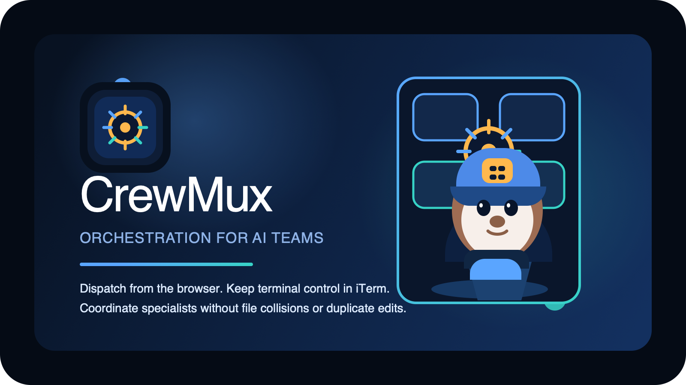

# CrewMux



`crewmux`는 tmux 세션을 기반으로 여러 AI CLI 에이전트를 한 팀처럼 묶어 관리하는 Rust CLI + 웹 대시보드입니다.

## 현재 제공 기능

- 프로젝트별 팀 세션 생성, 중지, 재연결
- master 에이전트 자동 부팅
- Claude/Codex 워커 스폰과 태스크 디스패치
- 기본 master orchestration prompt 자동 bootstrap
- tmux pane 출력 캡처, 브로드캐스트, Ctrl+C, 워커 종료
- 브라우저 기반 세션/에이전트 관리 UI
- macOS `launchd` 기반 대시보드 백그라운드 실행
- 설치 스크립트에서 tmux / Node.js / Rust / Claude CLI / Codex CLI 자동 설치

## 요구 사항

- macOS 권장
- Linux도 CLI와 `crewmux web`은 사용 가능하지만 서비스 설치 헬퍼는 아직 없음
- [tmux](https://github.com/tmux/tmux)
- [Rust](https://rustup.rs)
- `claude` CLI 또는 `codex` CLI
- 둘 다 설치되어 있으면 master/worker 타입을 자유롭게 선택 가능
- 둘 중 하나만 있어도 해당 provider만 사용해 세션 운영 가능

`./install.sh`는 위 의존성을 자동으로 맞추려 시도합니다. 기본값은 `claude` + `codex` 둘 다 설치이며, 특정 provider만 원하면 `CREWMUX_INSTALL_AGENTS=claude ./install.sh` 또는 `CREWMUX_INSTALL_AGENTS=codex ./install.sh`처럼 제한할 수 있습니다.

## 설치

### Homebrew

```bash
brew tap crewmux/tap
brew install --HEAD crewmux/tap/crewmux
```

첫 stable tag 이후에는 `brew install crewmux/tap/crewmux`로 설치할 수 있습니다.

stable release를 운영하는 절차와 자동화는 [Release Strategy](docs/release-strategy.md)에 정리돼 있습니다.

### 로컬 저장소 기준

```bash
git clone <repo-url> crewmux
cd crewmux
./install.sh
```

비대화식 설치(`curl | bash`)에서는 서비스 설치도 기본으로 함께 진행됩니다. 원하지 않으면 `CREWMUX_INSTALL_SERVICE=0 ./install.sh`를 사용하세요.

설치 스크립트가 처리하는 항목:

1. `tmux`, `curl`, `git` 확인 및 시스템 패키지 설치
2. Node.js / npm 확인 후 Claude Code CLI, Codex CLI 설치
3. Rust toolchain 설치
4. `cargo build --release`
5. `~/.local/bin/crewmux` 설치
6. 기존 `~/.local/bin/cm`, `~/.local/bin/ai` 제거
7. `~/.crewmux/` 데이터 디렉토리 준비
8. 선택적으로 `crewmux install` 실행

### 수동 설치

```bash
cargo build --release
mkdir -p ~/.local/bin
cp target/release/crewmux ~/.local/bin/crewmux
rm -f ~/.local/bin/cm ~/.local/bin/ai
```

`~/.local/bin`이 `PATH`에 없다면 셸 프로필에 아래를 추가합니다.

```bash
export PATH="$HOME/.local/bin:$PATH"
```

## 빠른 시작

### 1. 프로젝트에서 팀 시작

```bash
cd /path/to/project
crewmux team start
```

### 2. 워커 스폰

```bash
crewmux team start -t codex -m gpt-5.4
crewmux task spawn -t codex -m gpt-5.3-codex "Fix the login bug"
crewmux task spawn -t claude -n 2 "Write regression tests"
```

### 3. 상태 확인과 제어

```bash
crewmux ctl status
crewmux ctl peek codex-1 -l 100
crewmux ctl send master "Summarize worker progress"
crewmux ctl interrupt all
```

### 4. 웹 대시보드

```bash
crewmux web
# 또는 macOS 로그인 시 자동 실행
crewmux install
```

기본 주소는 [http://localhost:7700](http://localhost:7700) 입니다.

## Master 운영 전략

master는 기본적으로 `~/.crewmux/master-prompt.md`를 사용합니다. 파일이 없으면 첫 master 실행 시 제품 내장 기본 템플릿이 자동 생성됩니다.
예전 기본 템플릿(`ai` 명령 구문을 쓰던 버전)이 남아 있으면 `.legacy.bak`로 백업한 뒤 새 템플릿으로 교체합니다.

기본 전략:

- 같은 파일/모듈을 동시에 수정하는 워커를 만들지 않음
- write ownership을 파일/디렉토리 단위로 명시함
- 겹치는 변경은 병렬보다 순차 실행을 우선함
- 구현 워커와 리뷰/검증 워커를 역할 분리함
- 이미 같은 영역을 담당 중인 워커가 있으면 새 워커를 추가로 만들지 않고 follow-up을 보냄

원하면 `~/.crewmux/master-prompt.md`를 직접 수정해 팀 운영 규칙을 커스터마이즈할 수 있습니다.

## 중요한 동작 규칙

- 세션 이름은 프로젝트 디렉토리명에서 자동 생성됩니다. 예: `/Users/ko/my-project` -> `crewmux-my-project`
- `crewmux task *`와 `crewmux ctl *` 명령은 현재 작업 디렉토리 기준으로 세션을 찾습니다
- 따라서 세션을 시작한 프로젝트 디렉토리 안에서 제어 명령을 실행하는 것이 기본 전제입니다
- `crewmux team start -t <provider> -m <model>`로 master provider/model을 지정할 수 있습니다
- CLI의 `crewmux task spawn`은 태스크 문구가 필수입니다
- 웹 UI/API는 태스크 없이 idle worker를 띄우는 것도 허용합니다
- `crewmux ctl interrupt all`과 `POST /api/interrupt`의 `target=all`은 master + 모든 worker에 Ctrl+C를 보냅니다. log pane은 제외됩니다
- 기존 `cm-*`, `ai-*` tmux 세션과 `~/.ai-team` 메타데이터도 자동으로 읽어 마이그레이션 없이 이어서 제어할 수 있습니다

## 저장 경로

```text
~/.crewmux/
├── tasks/<session>/meta.json
├── logs/<session>.log
├── service/stdout.log
├── service/stderr.log
└── master-prompt.md
```

- `meta.json`: 현재 세션의 pane/worker/task 상태
- `logs/*.log`: task dispatch와 remote send 기록
- `master-prompt.md`: 기본 master orchestration 규칙. 없으면 자동 생성

## 문서 안내

- [Getting Started](docs/getting-started.md): 설치부터 첫 세션 실행까지
- [CLI Reference](docs/cli-reference.md): 모든 서브커맨드와 주의사항
- [Web API Reference](docs/api-reference.md): 대시보드/API 연동용 엔드포인트
- [Architecture](docs/architecture.md): 런타임 구조와 상태 모델
- [Brand Guide](docs/brand-guide.md): 아이콘, 마스코트, 기본 색상 자산
- [Homebrew](docs/homebrew.md): tap/formula/release workflow
- [Release Strategy](docs/release-strategy.md): stable release, 태그, Homebrew stable automation
- [Orchestration Guide](docs/orchestration-guide.md): master가 충돌 없이 워커를 배치하는 기본 전략
- [Design Specification](docs/design-spec.md): 제품 목표, 범위, 제약
- [Open Source Release](docs/open-source-release.md): 공개 배포 전 체크리스트와 네이밍 메모
- [Troubleshooting](docs/troubleshooting.md): 자주 막히는 상황과 해결 방법
- [Contributing](CONTRIBUTING.md): 로컬 개발/검증/PR 규칙

## 품질 게이트

로컬 기본 검증:

```bash
cargo fmt
cargo test
cargo clippy --all-targets --all-features -- -D warnings
bash -n install.sh
```

GitHub Actions CI 예시는 `.github/workflows/ci.yml`에 포함돼 있습니다.

## 현재 제약

- 서비스 설치는 macOS `launchd`만 지원합니다
- 실시간 출력 갱신은 WebSocket이 아니라 polling 기반입니다
- `crewmux team stop-all`은 이름이 `crewmux-` 또는 legacy `cm-`, `ai-`로 시작하는 tmux 세션을 모두 종료합니다
- Codex는 프로젝트별 trust 설정이 필요한데, `crewmux`가 스폰 시 해당 프로젝트를 자동으로 trusted로 등록합니다
- Linux에서는 installer가 의존성 설치를 시도하지만 서비스 자동 설치는 아직 제공하지 않습니다
